# Hola 👋 soy Gabriel ☕️

> ***Café, Neovim y Coding***

💻 **Desarrollador Full-Stack** 
📚️ Estudiando **Ingeniería en Computación**.
👨‍💻 Apasionado por el mundo **Linux** y **OpenSource**

📫 Contacto: **nox030705@gmail.com**
🌐 Portafolio: **[portfolio-aqs8.onrender.com](https://portfolio-aqs8.onrender.com)**

# Tecnologías 👨🏻‍💻

### Languages

### Tools

### Services

### Frameworks

 

### AI

  

# Stats 📊

